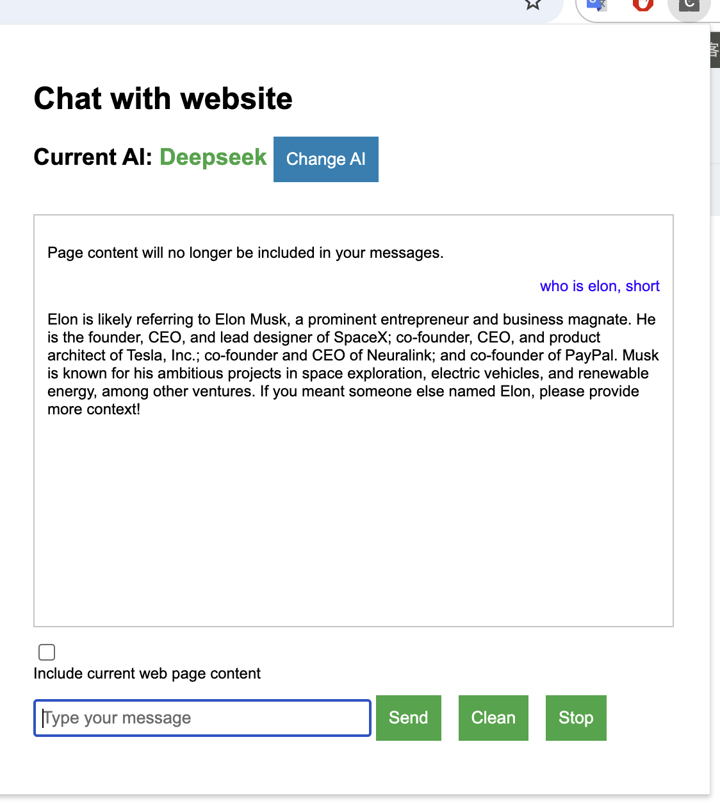
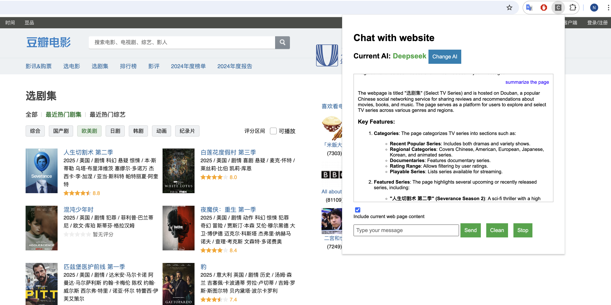

# Chat with Website

## Overview
Chat with Website is a Chrome extension that lets you interact with AI chat services while summarizing webpage content. Users can choose between DeepSeek and OpenAI services to generate responses based on their inputs and page content.

## Features
- Save and manage API keys for both DeepSeek and OpenAI.
- Chat with an AI that summarizes webpage content.
- Extract visible text, headings, and important links from webpages.
- Format and display code snippets using Markdown.

## Installation
1. Clone or download the repository.
2. Open Chrome and navigate to `chrome://extensions/`.
3. Enable "Developer mode" at the top right.
4. Click "Load unpacked" and select the  folder.

## Demo 



## Usage
1. Click on the extension icon to open the popup.
2. Select your AI service (DeepSeek or OpenAI) from the dropdown.
3. Enter your API key and click "Save API Key".
4. The chat interface will appear once a valid key is saved.
5. Send messages to interact with the AI or click "Summarize" to get a summary of the current webpage.
6. Optionally, enable the checkbox to include the current webpage content in your messages.

## File Structure
- **popup.html** – Popup interface for the extension.
- **popup.js** – Handles user interaction in the popup.
- **styles.css** – Styles for the popup and chat interface.
- **options.js** – Manages extension settings, chat options, and conversation history.
- **background.js** – Communicates with AI services and processes summarization requests.
- **content.js** – Listens for messages to extract and return page content.
- **contentExtractor.js** – Provides functions to extract text, headings, and links from web pages.
- **contentExtractor.test.js** – Unit tests for content extraction.
- **manifest.json** – Chrome extension manifest defining permissions and scripts.
- **marked.min.js** – Markdown parser used for formatting AI responses.

## Development
- Uses Chrome APIs such as `chrome.storage`, `chrome.runtime`, and `chrome.scripting` for core functionality.
- The extension is built with Manifest V3.
- Communication is managed via messaging between popup, background, and content scripts.

## Testing
To run tests for the content extractor, use your preferred JavaScript testing framework. For example, if using Jest:
```
npm test
```
Ensure Node.js and necessary packages are installed.

## License
This project is licensed under the MIT License.

